🚢 SMART-BOL+
AI-Verified, Blockchain-Enforced Bill of Lading System
📌 Project Description

SMART-BOL+ is an AI-powered and blockchain-enforced system that prevents duplicate ownership and fraud in digital Bills of Lading (BoL).

Traditional logistics systems rely on centralized databases vulnerable to tampering, duplication, and double-financing risks.

SMART-BOL+ introduces a three-layer trust architecture:

🧠 AI validates document integrity

🛡 Backend enforces policy decisions

⛓ Blockchain guarantees immutable ownership

This ensures:

One document = One owner

No duplicate minting

No denial of AI-verified results

Immutable audit trail

🏗 System Architecture
User
  ↓
Frontend (React + Ethers.js)
  ↓
Backend (FastAPI + AI + Hashing)
  ↓
Policy Gate (Fraud Threshold Check)
  ↓
Smart Contract (ERC-721)
  ↓
Anvil (Local Ethereum Node)

🧠 Module Breakdown
🔹 1️⃣ AI + Backend Module (Aleena)

Responsible for:

✔ OCR & structured document parsing
✔ Fraud scoring logic
✔ SHA-256 document hashing
✔ Backend policy enforcement
✔ Blockchain contract integration via Web3.py
✔ Duplicate detection via on-chain lookup

Core Flow

User uploads BoL

Backend extracts structured data

Fraud score generated

If fraud score < threshold → mint allowed

Hash stored on blockchain

Transaction hash returned

Backend Tech Stack

Python

FastAPI

Web3.py

SHA-256 hashing

Hardhat / Anvil

Solidity integration

Backend Folder Structure
backend/
│
├── ai/
│   ├── ocr.py
│   ├── parser.py
│   ├── fraud_engine.py
│
├── blockchain/
│   ├── client.py
│   ├── abi/
│
├── utils/
│   ├── hash_utils.py
│
├── main.py
└── requirements.txt

🔹 2️⃣ Blockchain Module (Merin)

Smart Contract enforcing deterministic ownership.

What It Does

✔ Mints ERC-721 NFT for verified BoL
✔ Prevents duplicate document hash minting
✔ Maintains documentHash → tokenId mapping
✔ Creates immutable audit record

Smart Contract Features
function mint(address to, bytes32 documentHash) external;

Prevents duplicates:

mapping(bytes32 => uint256) public documentHashToTokenId;

One document hash = One NFT.

Blockchain Tech Stack

Solidity

Foundry (Forge)

Anvil (Local Ethereum)

OpenZeppelin ERC-721

🔹 3️⃣ Frontend Module (Merin)

React-based UI for interacting with smart contract.

Features

✔ Connect MetaMask
✔ Mint BoL NFT
✔ Prevent duplicate mint attempts
✔ View owned NFTs
✔ Display transaction status

Frontend Tech Stack

React (Vite + TypeScript)

Ethers.js v6

MetaMask

Foundry deployment

⚙️ Installation & Setup
🧠 Backend Setup (AI + Integration)
cd backend
python3 -m venv venv
source venv/bin/activate
pip install -r requirements.txt

Run backend:

uvicorn main:app --reload

Open API docs:

http://127.0.0.1:8000/docs

⛓ Blockchain Setup (Foundry + Anvil)
1️⃣ Install Foundry
curl -L https://foundry.paradigm.xyz | bash
foundryup

2️⃣ Start Local Chain
anvil

Runs at:

http://127.0.0.1:8545

3️⃣ Build Contract
forge build

4️⃣ Deploy
forge script script/Deploy.s.sol \
--rpc-url http://127.0.0.1:8545 \
--private-key <ANVIL_PRIVATE_KEY> \
--broadcast

Update frontend with:

CONTRACT_ADDRESS

CONTRACT_ABI

💻 Frontend Setup
cd frontend
npm install
npm run dev

Runs at:

http://localhost:5173

📖 API Documentation

FastAPI auto-generated docs:

http://127.0.0.1:8000/docs

Main Endpoint

POST /verify-bol

Accepts:

Multipart file upload

Returns:

Parsed data

Fraud score

SHA-256 hash

Blockchain transaction hash

Block number

Status

🛡 Security Design

Trust Boundaries:

User → Untrusted
AI → Probabilistic
Backend → Policy Enforcement
Blockchain → Deterministic & Immutable

📸 Screenshots

(Add images inside /screenshots folder)

1️⃣ Swagger API Interface
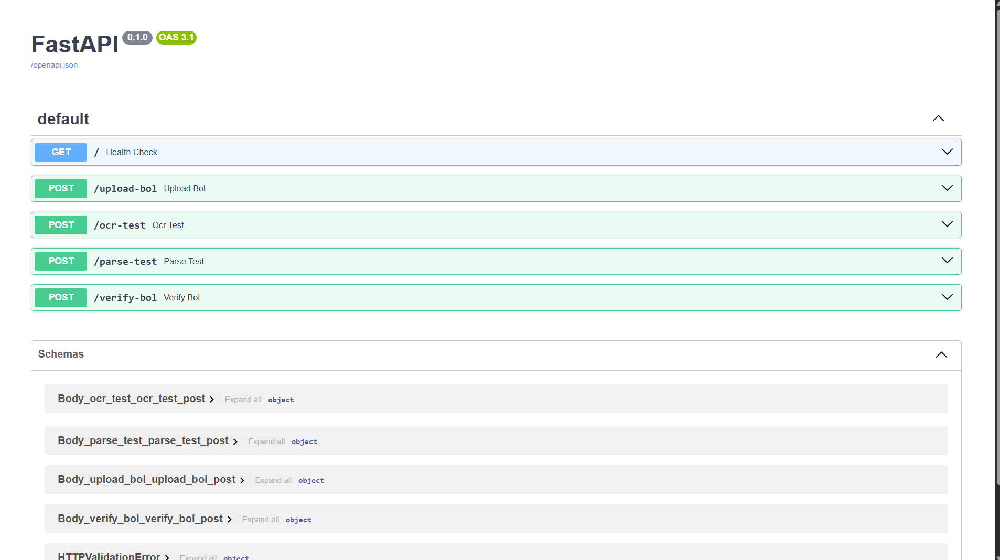

2️⃣ Verification Response
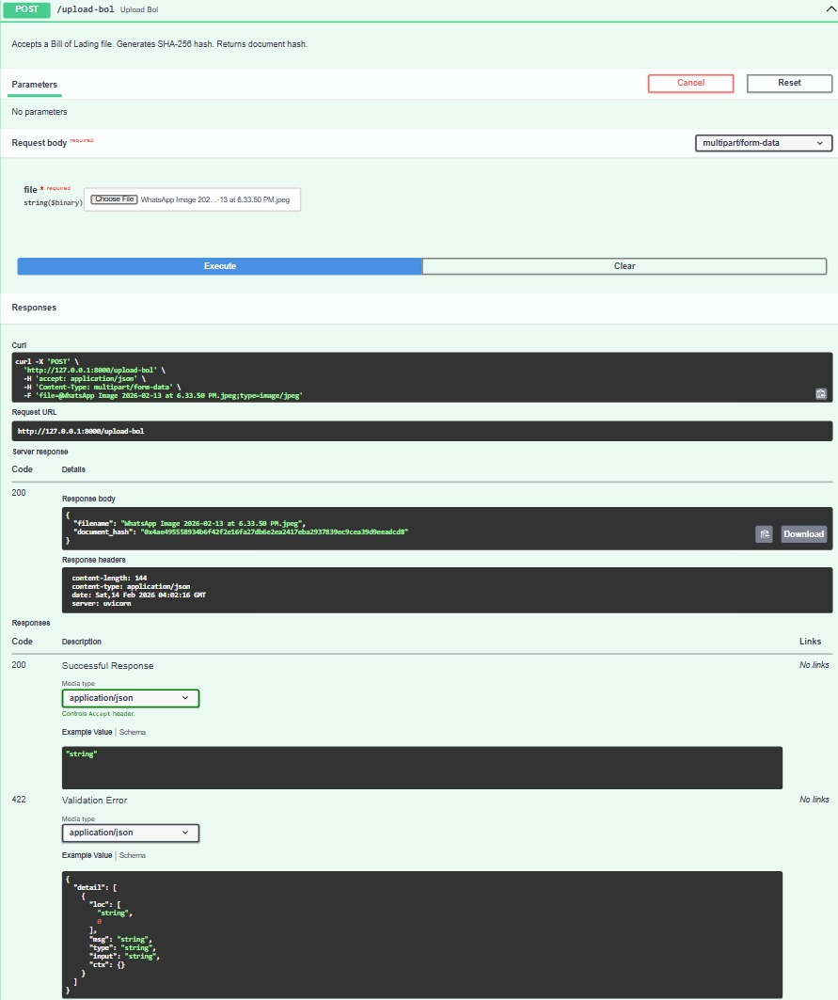

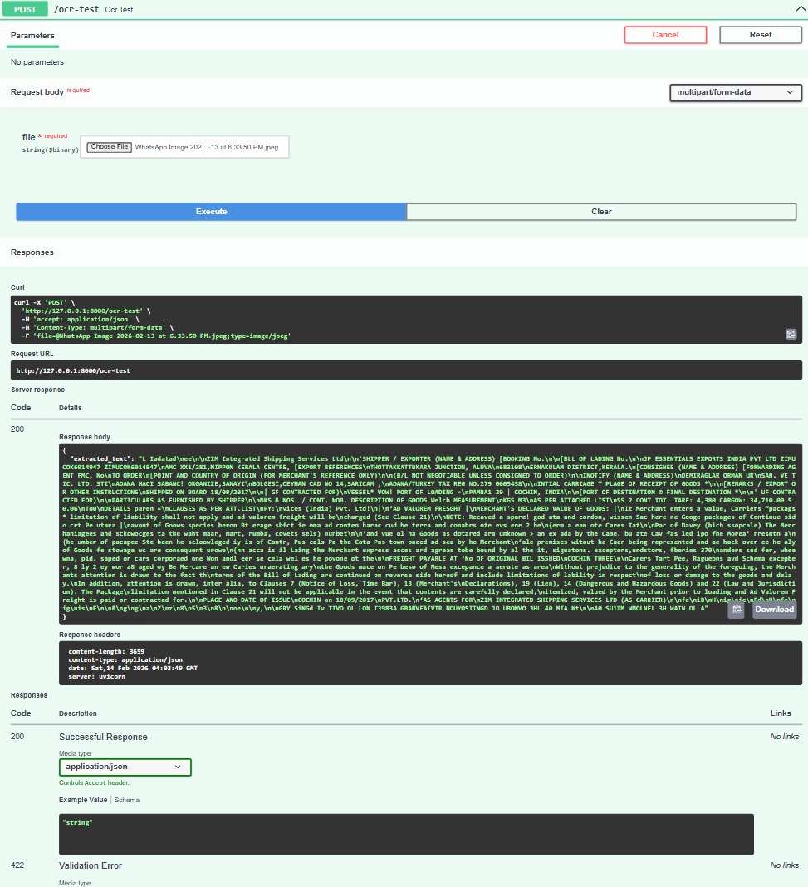

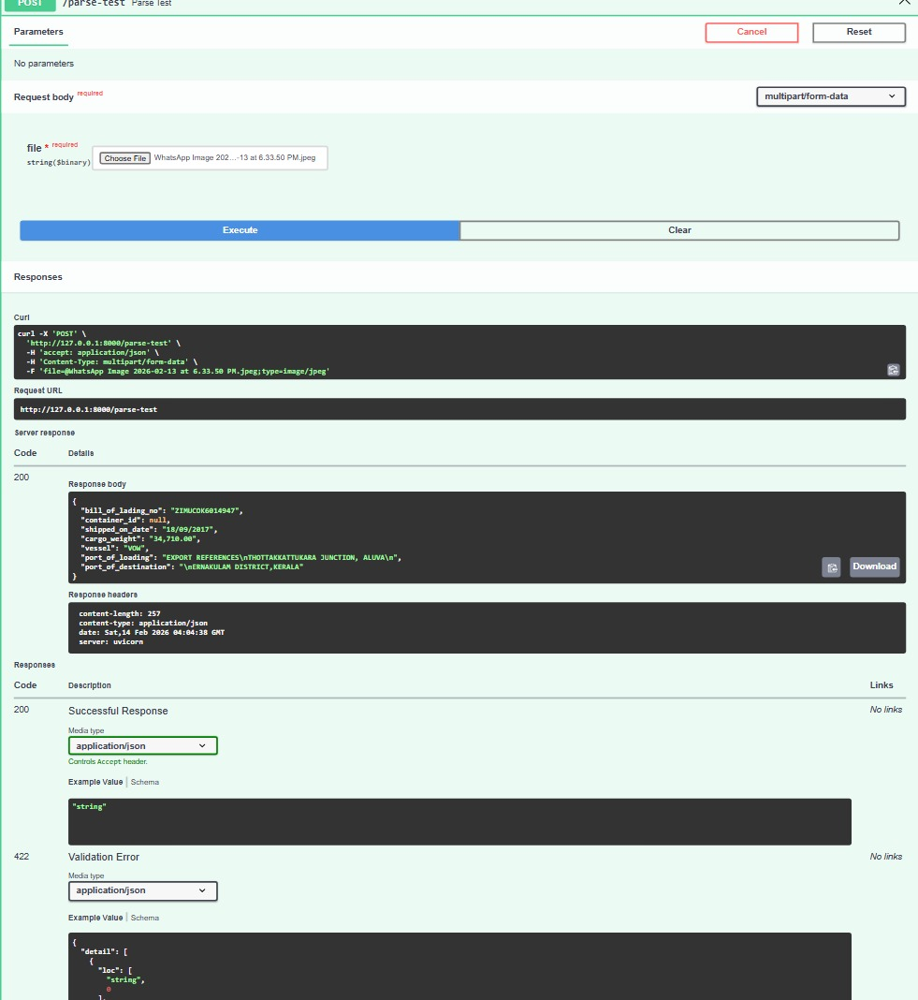

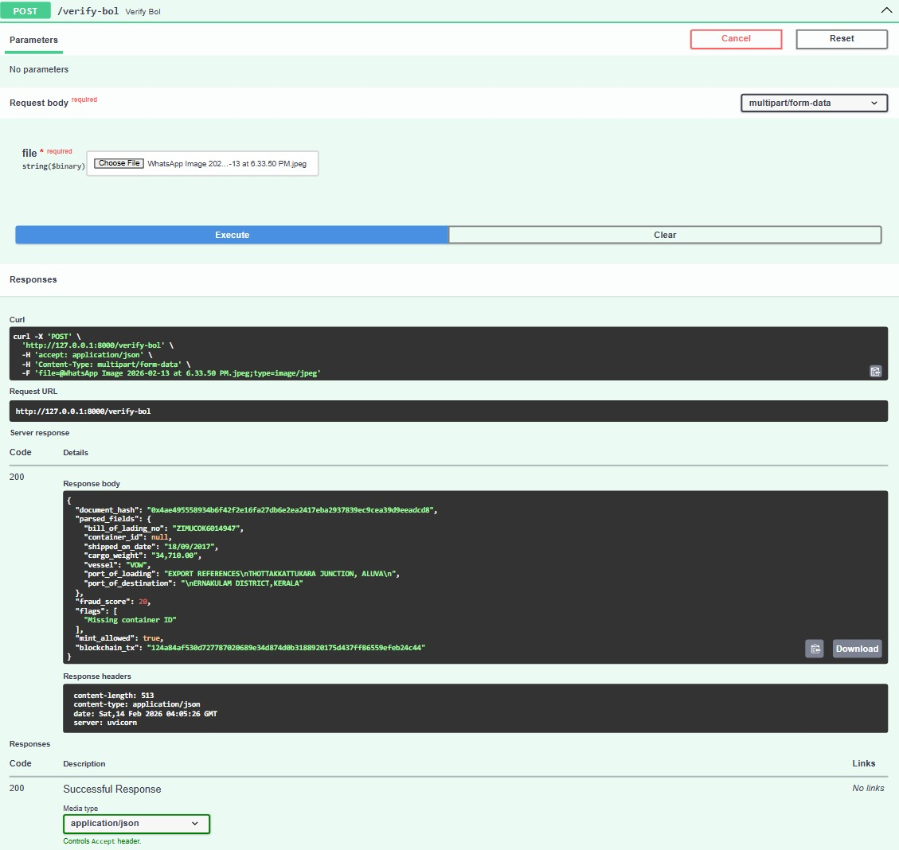

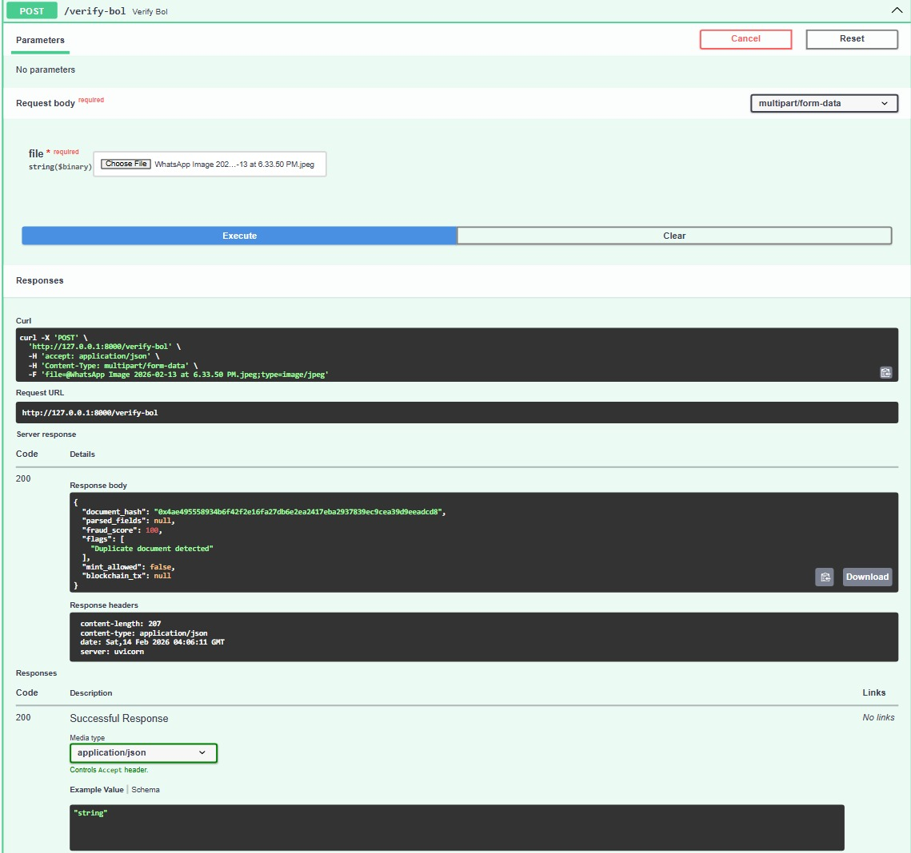

3️⃣ NFT Mint Transaction

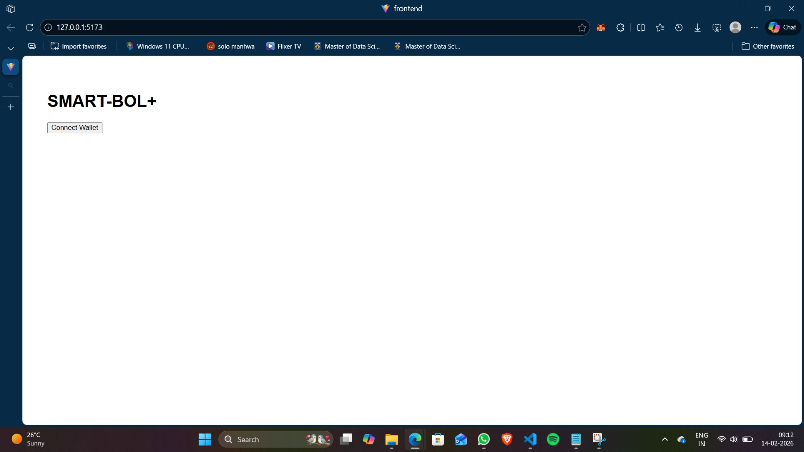

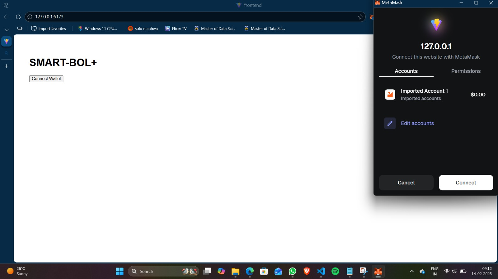

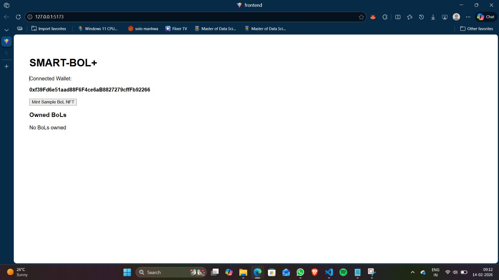

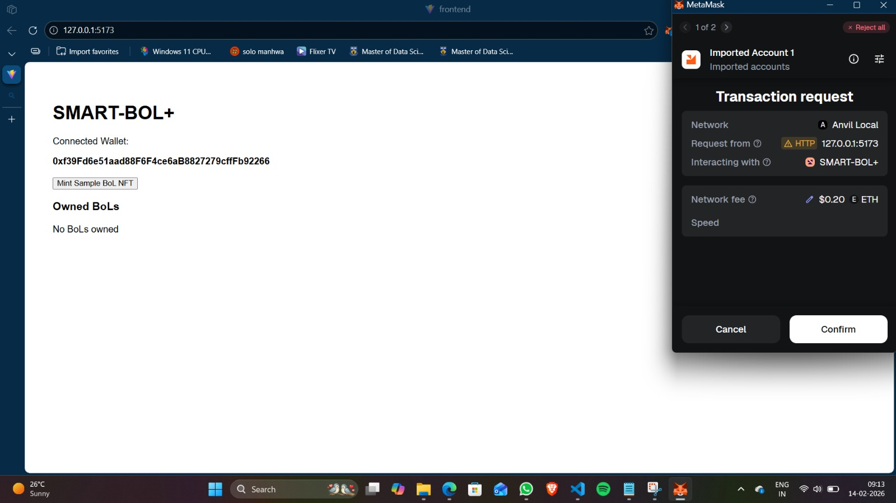

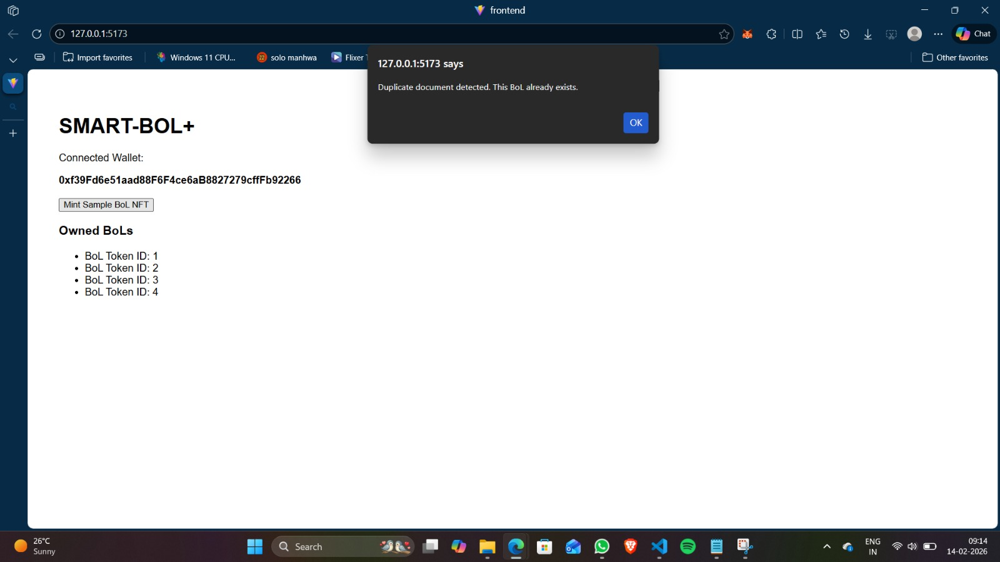

🎬 Demo Videos

📦 Required Root Files

✔ README.md
✔ .gitignore
✔ backend/requirements.txt
✔ frontend/package.json

👥 Team Members

Aleena – AI Engine, Backend Architecture, Blockchain Integration

Merin – Smart Contract Development, Frontend Implementation

🔮 Future Improvements

Public testnet deployment (Sepolia / Polygon)

IPFS metadata storage

Bank verification dashboard

Trade finance automation

Role-based mint permissions

Advanced ML fraud detection